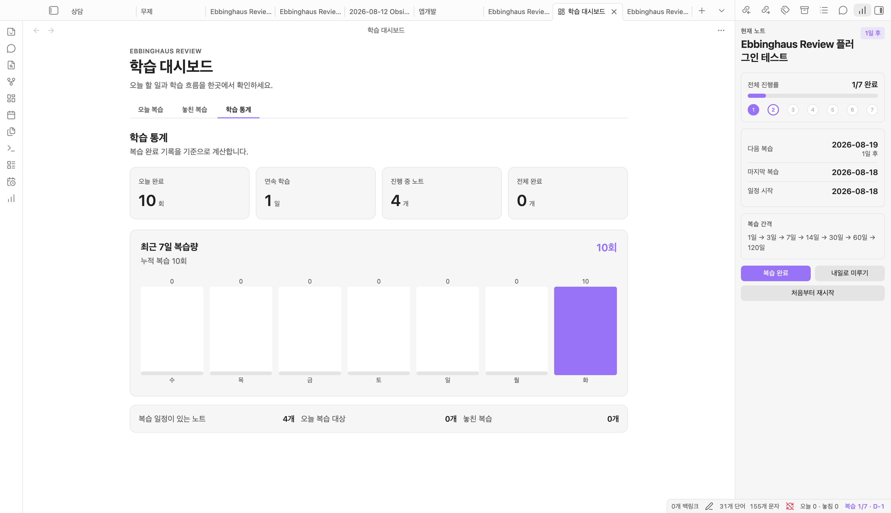
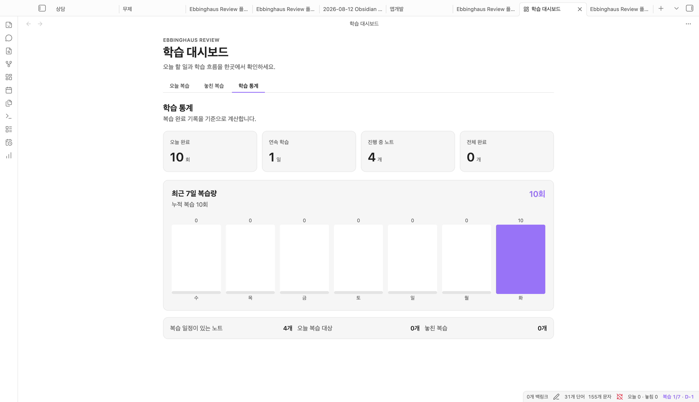

# Ebbinghaus Review for Obsidian

[English](README.md) · [한국어](README.ko.md)

노트마다 에빙하우스식 간격 복습 일정을 기록하고, 오늘 복습할 노트를 Obsidian 안에서 알려주는 플러그인입니다.

> 이 플러그인의 기본 간격은 실용적인 간격 반복 프리셋이며, 에빙하우스의 실험 결과를 개인별로 정확히 재현하는 의학적·과학적 모델은 아닙니다. 설정에서 간격을 자유롭게 바꿀 수 있습니다.

## 사용 화면

### 학습 대시보드와 현재 노트 복습 현황

오늘 복습할 노트와 학습 통계를 한곳에서 확인하면서, 오른쪽 패널에서 현재 노트의 진행률과 다음 복습일을 볼 수 있습니다.



### 학습 통계

오늘 완료한 복습 수, 연속 학습일, 진행 중인 노트와 최근 7일 복습량을 확인할 수 있습니다.



## 주요 기능

- 현재 노트에 `1, 3, 7, 14, 30, 60, 120일` 복습 일정 시작
- 오늘 또는 이미 지난 복습 노트를 모달과 상태 표시줄에서 확인
- 현재 노트의 진행률, 다음 복습일, 남은 날짜를 오른쪽 복습 현황 패널에서 확인
- Obsidian 시작·플러그인 업데이트·패널 닫힘 후 현황 패널 자동 복원
- 진행 단계 숫자에 마우스를 올려 단계별 예정일과 오늘 기준 남은 날짜 확인
- 학습 대시보드에서 오늘 또는 기한이 지난 복습 노트를 한 번에 처리
- 놓친 복습 탭에서 예정일이 지난 노트를 오래된 순으로 별도 확인
- 오늘 완료, 연속 학습일, 진행 중/완료 노트, 최근 7일 복습량 통계
- **복습 완료**로 다음 단계 예약, **내일로 미루기**로 하루 미루기
- 잘못 누른 마지막 복습 완료를 이전 단계와 날짜, 통계까지 함께 취소
- Obsidian 내부 알림과 선택적 운영체제 알림
- 간격, 알림 시각, 확인 주기 설정
- 학습 상태를 플러그인 내부에 저장해 노트 속성을 깔끔하게 유지
- 데스크톱과 모바일에서 사용할 수 있는 Obsidian API만 사용
- Obsidian에서 앱 번역이 완료된 46개 언어를 자동 감지하고, 알 수 없는 새 언어는 영어로 표시

## 개발 및 빌드

Obsidian 1.8.7 이상이 필요합니다.

```bash
npm install
npm run check
```

개발 중에는 메인 볼트 대신 별도 테스트 볼트를 권장합니다. 빌드 후 아래 세 파일을 테스트 볼트의 `.obsidian/plugins/ebbinghaus-review/`에 복사합니다.

- `main.js`
- `manifest.json`
- `styles.css`

Obsidian의 **Settings → Community plugins**에서 `Ebbinghaus Review`를 켭니다.

## 사용법

1. 복습할 Markdown 노트를 엽니다.
2. 명령 팔레트에서 **Ebbinghaus Review: Start or restart review schedule for current note**를 실행합니다.
3. 상태 표시줄의 `복습 0/7 · D-1` 또는 막대그래프 리본 아이콘을 눌러 현재 노트의 복습 현황을 확인합니다.
4. 리본의 달력 아이콘이나 상태 표시줄의 `오늘 N · 놓침 N`을 눌러 학습 대시보드를 엽니다.
5. 학습을 마치면 현황 패널의 **복습 완료**를 눌러 다음 복습일을 예약합니다.
6. 대시보드의 **학습 통계** 탭에서 최근 7일 복습량과 연속 학습일을 확인합니다.

예를 들어 2026-08-18에 일정을 시작하면 기본 설정의 첫 복습일은 2026-08-19입니다. 해당 복습을 2026-08-19에 완료하면 다음 복습일은 완료일로부터 3일 뒤인 2026-08-22입니다. 늦게 복습한 경우에는 실제 완료일을 기준으로 이후 간격을 계산합니다.

## 학습 정보 저장

복습 일정과 진행 이력은 플러그인의 내부 데이터에 저장되므로 노트에 별도 속성이 추가되지 않습니다. 0.4.x 이하 버전에서 만든 `ebbinghaus_review_*` 속성은 플러그인 업데이트 시 내부 저장소로 자동 이전된 후 노트에서 제거됩니다. 노트를 이동하거나 이름을 바꾸면 내부 기록도 함께 갱신됩니다.

## 명령

- `현재 노트 복습 일정 시작 또는 재시작`
- `현재 노트를 복습 완료로 기록`
- `현재 노트의 마지막 복습 완료 취소`
- `현재 노트 복습을 내일로 미루기`
- `오늘 복습 목록 열기`
- `현재 노트 복습 현황 패널 열기`
- `학습 대시보드 열기`
- `학습 통계 화면 열기`
- `놓친 복습 목록 열기`

## 알림 동작

- Obsidian이 열려 있을 때만 복습일을 확인합니다.
- 하루에 한 번 알림을 표시합니다.
- 시작 시 알림을 켜면 설정된 시각 전이라도 앱 실행 후 오늘 복습을 알려줍니다.
- 운영체제 알림은 설정에서 직접 켜고 권한을 허용해야 합니다.
