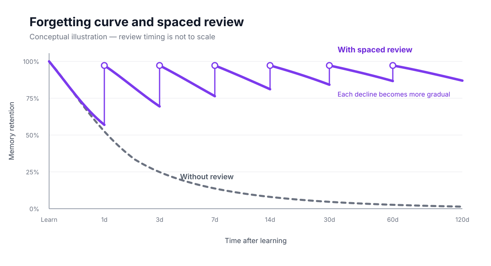
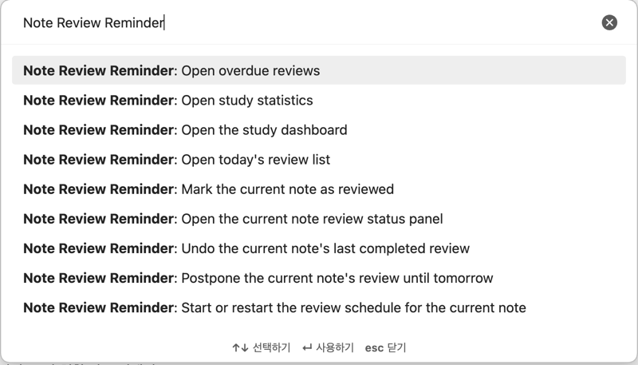
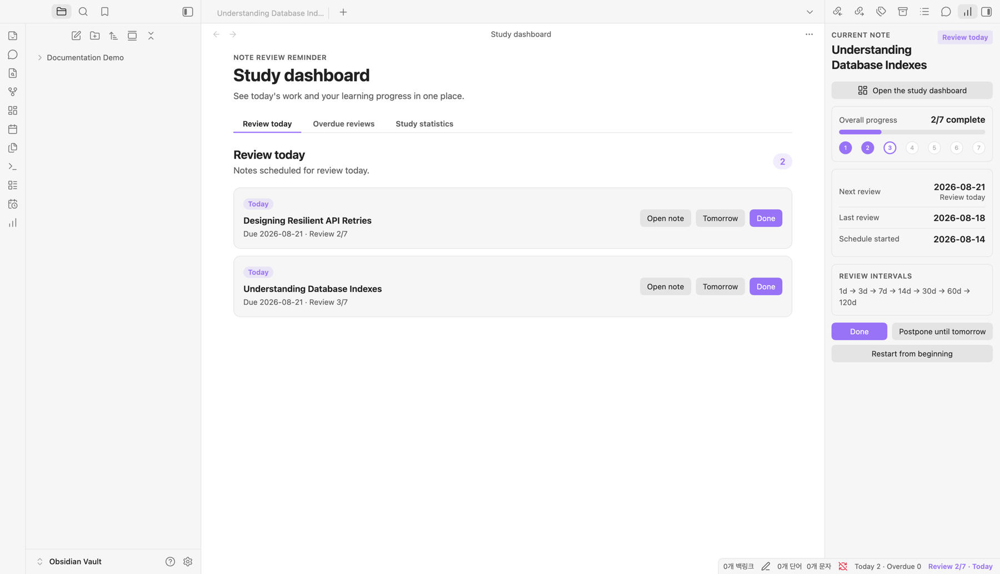
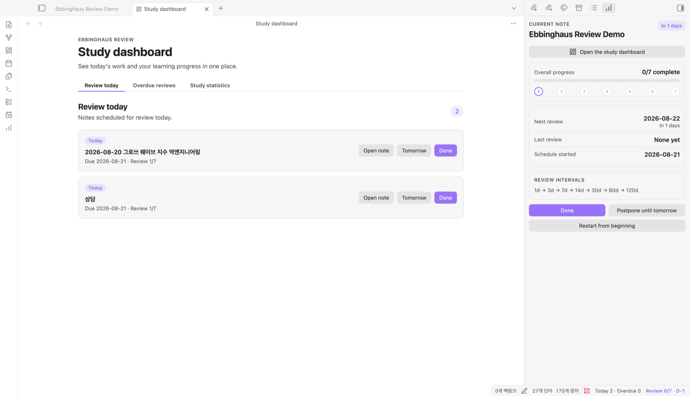
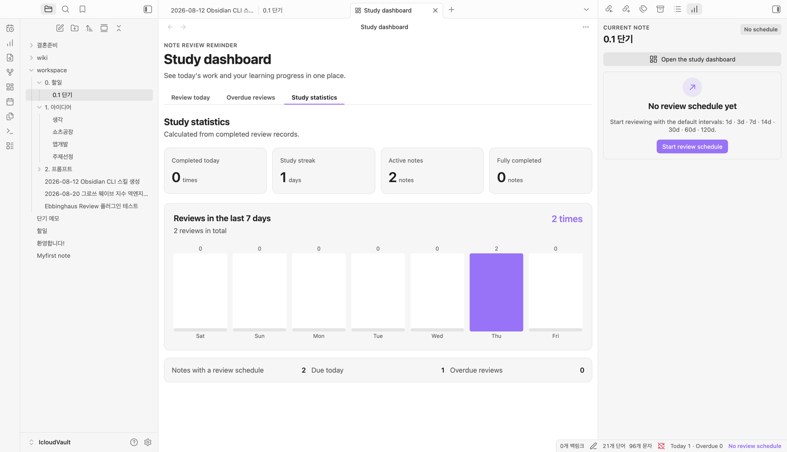

# Note Review Reminder for Obsidian

[English](README.md) · [한국어](README.ko.md)

Schedule spaced reviews for each note, see what is due today or overdue, and track your learning progress without adding properties to the top of your notes.

### The forgetting curve

The Ebbinghaus forgetting curve describes a general tendency of memory: without review, recall drops quickly soon after learning, then the rate of forgetting gradually slows. Reviewing material before it is forgotten strengthens retention and makes it possible to wait longer before the next review.

This plugin applies that idea through spaced repetition. Reviews begin close together and become progressively farther apart as the note advances through its schedule.



*Conceptual illustration. Actual retention and effective review intervals vary by learner and material; the timeline is not to scale.*

> The default intervals are a practical spaced-repetition preset. They do not claim to reproduce Ebbinghaus's experimental results exactly for every learner. You can customize the intervals in settings.

### Highlights

- Start a configurable `1, 3, 7, 14, 30, 60, 120 day` review schedule for any note.
- Review today's notes, overdue notes, progress, and seven-day activity from a dedicated dashboard.
- Open the study dashboard directly from the current-note review status panel.
- Mark a review complete, postpone it until tomorrow, or undo an accidental completion.
- Keep review data in plugin storage so note properties stay clean.
- Detect review-data changes from another device in an iCloud-based vault without restarting Obsidian.
- Receive in-app and optional operating-system notifications.
- Use the same plugin on desktop and mobile.
- Keep the last card and controls clear of Obsidian's floating mobile navigation.
- Automatically match Obsidian's interface language across all 46 completed app locales; unknown future locales fall back to English.
- Follow Obsidian's language by default or choose any supported language in the plugin settings.
- Find every plugin command by searching for `Note Review Reminder` in the command palette, regardless of the selected interface language.

### Screenshots

#### Find commands by plugin name

Open the command palette with `Cmd+P` on macOS or `Ctrl+P` on Windows/Linux, then type `Note Review Reminder`. Obsidian groups the localized commands under the plugin name so they remain searchable when you change the plugin interface language.



#### Review today's notes

See every note due today and complete, postpone, or open each review from one place.



#### Current-note review status



#### Study statistics



### Language support

The plugin uses Obsidian's official `getLanguage()` API and bundles translations for every locale marked as complete for the app in the [official Obsidian translations repository](https://github.com/obsidianmd/obsidian-translations#existing-languages). No network connection is needed for translation. English is used as a safe fallback for newly added or unknown locales.

Translations are machine-assisted. Korean has completed a manual editorial review; every other localized dictionary has full structural QA and targeted terminology corrections but still needs native-speaker review before it can be considered native-certified. See the [translation quality and review status](docs/translation-quality.md).

### Usage

1. Open a Markdown note.
2. Open the command palette, search for `Note Review Reminder`, and run **Note Review Reminder: Start or restart the review schedule for the current note**.
3. Use the status bar or ribbon icons to open the current-note panel and study dashboard.
4. Select **Done** after studying, or postpone the review until tomorrow.
5. Check the **Study statistics** tab for your streak and recent activity.

### Development

Requires Obsidian 1.8.7 or later.

```bash
npm install
npm run check
```

Run `npm run audit:i18n` to validate all 4,884 localized messages independently.

Copy `main.js`, `manifest.json`, and `styles.css` into a test vault's `.obsidian/plugins/ebbinghaus-review/` directory, then enable **Note Review Reminder** under **Settings → Community plugins**.

### License

Note Review Reminder is available under the [MIT License](LICENSE).
